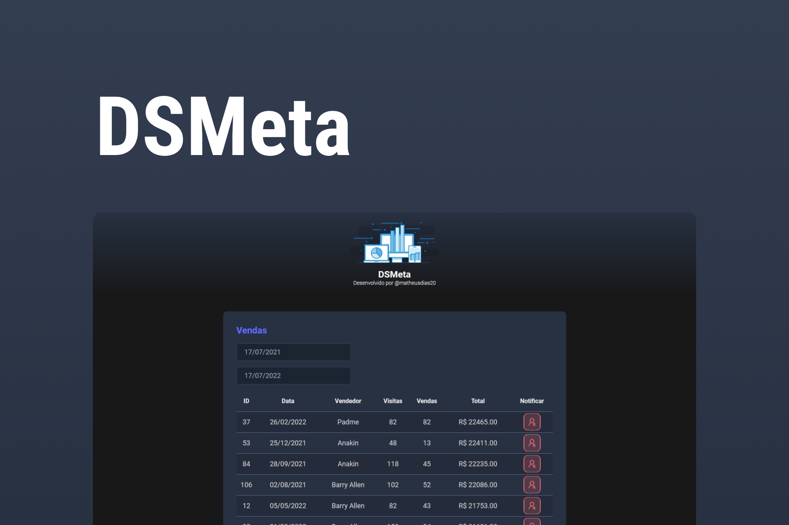

<h1 align="center">🤝 DSMeta</h1>

  <strong>App desenvolvido durante a 9ª edição do evento Semana Spring React</strong>
   
  O Projeto consiste em um app de consulta de vendas, no qual você poderá buscar vendas em um dado intervalo de datas, e poderá notificar via SMS os dados dos melhores vendedores.

  

### Site 💻

- [DSMeta](https://dsmeta-sigma.vercel.app)

## Linguagens: 🚀
- REACT
- JAVA

## Ferramentas: 🛠️

- Spring Tool Suite
- Postman

## Referências: ⌨️

- [Figma](https://www.figma.com/file/PehiT8Dw4Lv5ioTSULZeRI/DSMeta3)
